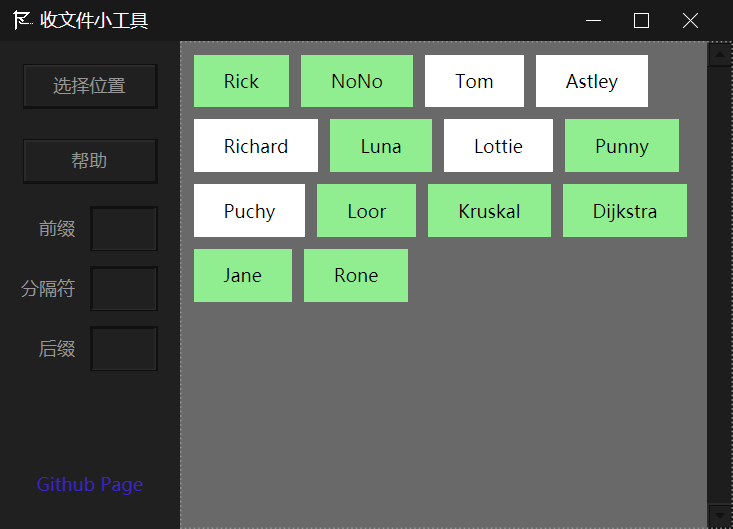
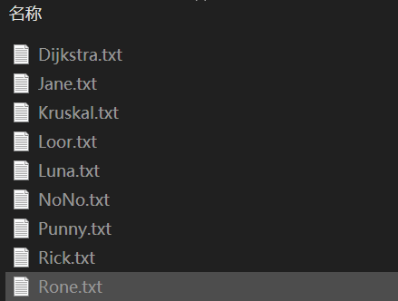

# 收文件小工具

命名格式不整齐？不知道有谁没交？一个应用解决你的收文件、收作业烦恼！

- 拖动文件 快速批量重命名
- 指定命名格式（前后缀）
- 实时查看收齐进度

## 下载

[下载地址](https://github.com/RickoNoNo3/CZMRenamer/releases)

## 使用方法

1. **将名单文件(.txt)放在空文件夹下，名单项按行分隔，然后【选择位置】。**
2. **将要命名的文件拖动到窗口中相应的名单项标签上，即可在名单文件所在位置生成指定命名格式的文件。**
3. **白色名单项为未生成；绿色名单项为已生成，再次拖至其上可替换。**

注：**最终文件名 = [前缀 + 分隔符] + 名单项 + [分隔符 + 后缀]**

　　**扩展名保留被拖动文件的原始扩展名，请勿在后缀中填写扩展名。**
